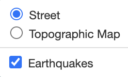
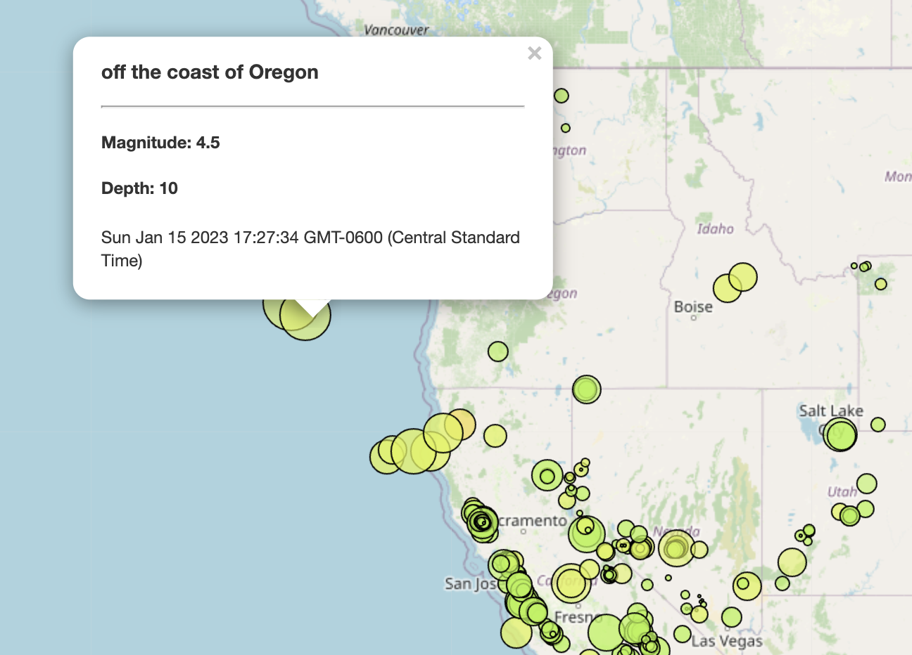
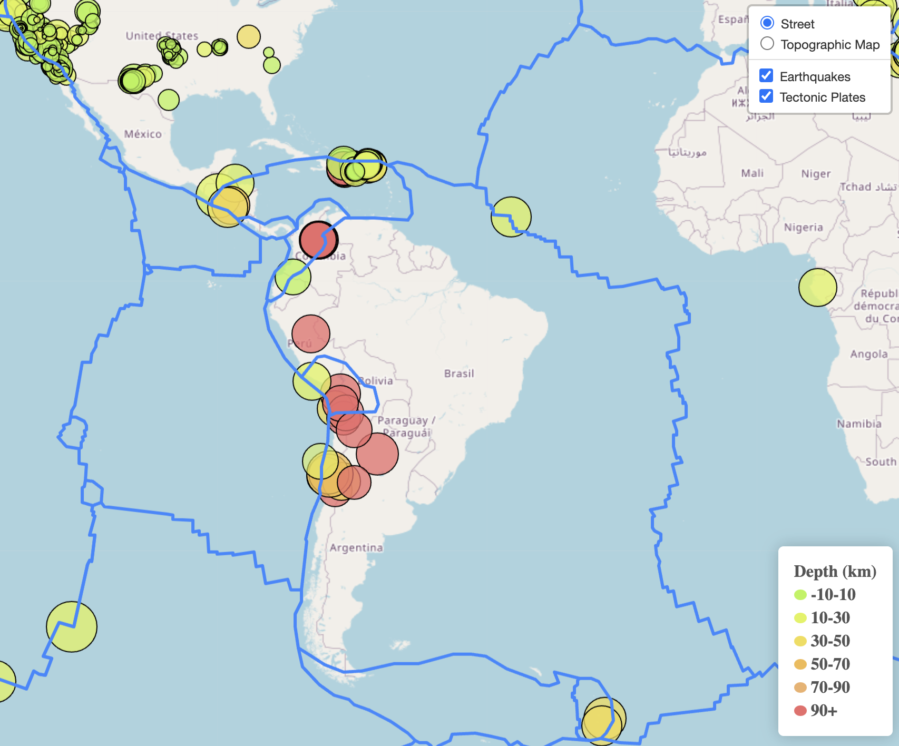

# Leaflet Challenge
## Glen Dagger

### Module 15 Challenge

For this challenge, I used my knowledge of Javascript and Leaflet to create a map that displays the locations of all earthquakes in the United States over the past 7 days. This data is updated regularly on the [USGS GeoJSON Feed page](https://earthquake.usgs.gov/earthquakes/feed/v1.0/geojson.php) at the [Past 7 Days - All Earthquakes](https://earthquake.usgs.gov/earthquakes/feed/v1.0/summary/all_week.geojson) link.

In part 1 of this challenge (located in the Leaflet-Part-1 subdirectory), I created a map that has street and topographical base layer options and an optional earthquake overlay that can be toggled on and off. This layer shows circle markers in the location of every earthquake that occurred in the past 7 days, where each marker's size corresponds to the earthquake's magnitude and the color corresponds to its depth. When clicked, each marker displays additional pop-up information about that earthquake.

In the optional part 2, located in the Leaflet-Part-2 subdirectory, I created a map with the same functionality that also has an overlay showing the boundaries of the tectonic plates. I decided to reorganize the code in this section to achieve the same end result without functions and a more linear logical flow. 

## Leaflet Part 1

In this section, I opted to create various functions that would create the map object, add layers and layer control, and create a legend for the circle marker colors. Generally, this code (contained in the [earthquake-map.js](./Leaflet-Part-1/static/js/earthquake-map.js) file in the part 1 folder) retrieves the API data, creates markers from the data, and then creates the map based on those markers and the base layers.

### chooseColor Function

First, I created a function *chooseColor* that returns a certain color (as a string) depending on the earthquake depth range. This function is used to define the colors of each earthquake marker as well as to create the legend.

 

### createLegend Function

This next function takes in the map object and creates the legend. I first set up a dictionary, *depthColors*, that maps the depth ranges to the corresponding color value. I used a digital color meter to match the colors to the colors shown in the example image on the assignment page.

I initialized the legend on the bottom right corner of the page and found the same block of code on multiple StackExchange threads that I used to create the legend. This code creates a new div with the class "legend" in the HTML. It also creates a list *labels* in which each element is the HTML code for each line in the legend, starting with the title "Depth (km"). It then loops through the earthquake depth ranges (all keys in the pre-defined *depthColors* dictionary) and appends a new circle of the appropriate color along with the associated range to the inner HTML of the legend class. After creating the list, the contents of the list are joined together into a single block of HTML, separated by line breaks, and added to the inner HTML of the legend.

 

### createMap Function

The purpose of this function is to take in a Leaflet map layer object and create the actual map. I used the Leaflet OpenStreetMap tile layers to set the street and topographical maps as options for the base layer. The overlay map is set to the argument of the function when called. I then created the map object with the street and earthquake layers selected by default, added layer control (screenshot directly below), and then called the *createLegend* function on the map object to add the legend.

 

### createMarkers Function

The purpose of this function is to create the markers for the earthquakes that will be passed into the *createMap* function as a single layer. This function takes in JSON data as its argument and loops through all features to pull the coordinates for each earthquake and create circle markers for each. The *chooseColor* function is used to determine the color of each marker based on the depth (the 3rd coordinate value). The radius of each circle is determined by its magnitude. I increased this size by a scale factor of 4 for increased visibility when viewing the map on a global scale.

Each marker, when clicked, displays a pop-up that shows the location, magnitude, depth, and time of each earthquake. I also added functionality so that the fillOpacity of each marker increases slightly when the user hovers over the circle. This helps the user to identify the circle they are about to select since the map is fairly cluttered when zoomed out, although it would be better if it were more obvious to the user. Finally, I created a layer group from my array of markers and called the *createMap* function to create the map.

 

### API Call

The final step was to make the API call to the GeoJSON data URL via the D3 library and call the *createMarkers* function on the response. 

 

## Leaflet Part 2

I had some difficulty determining how to incorporate the API call for the tectonic plate GeoJSON data into the code organization I used it part 1, so I decided to try re-structuring everything in my [Javascript code for part 2](./Leaflet-Part-2/static/js/earthquake2.js). Since the *createMap* and *createMarker* functions are only called once each, I decided to try removing them and having the code in part 2 follow a more linear flow.

I defined the same *depthColors* dictionary and *chooseColor* function from part 1. Next, I defined the street and topo layers for the base map. I then made the API call to the URL via D3 to loop through each earthquake, create the markers with all the same features/pop-up info, and grouped them as a single layer. Within this API call, I made a separate API call to the [tectonic plates GeoJSON url](https://raw.githubusercontent.com/fraxen/tectonicplates/master/GeoJSON/PB2002_boundaries.json) and use the L.geoJson function to add it to the map. 

Finally, I used the same code as above to create the legend and add it to the map.

